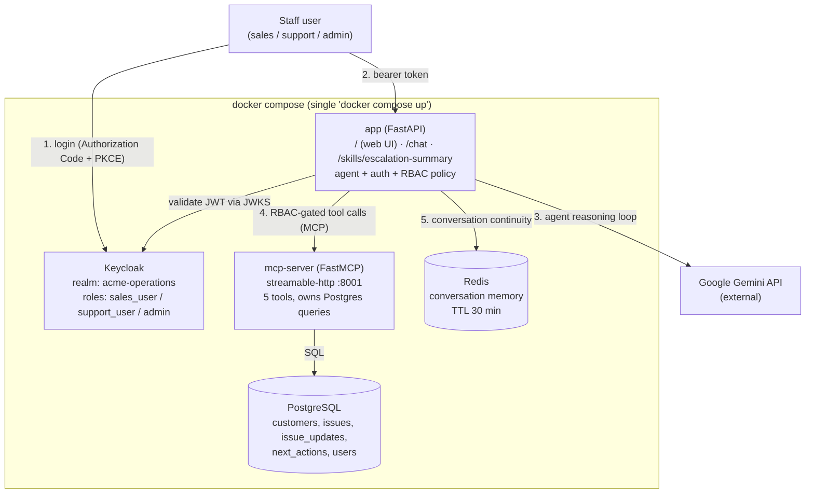

# Acme Operations — Agentic Enterprise Assistant

An agentic assistant prototype for Acme Operations that lets internal staff (sales, support, operations) ask natural-language questions about customers and issues — e.g. *"What open issues does Globex Corporation have, and what should we do next?"* — instead of manually navigating multiple systems. An LLM agent dynamically selects tools exposed over MCP, answers are grounded in PostgreSQL data, access is secured with Keycloak role-based access control, and every step of every request is logged for auditability. The entire stack runs locally with a single `docker compose up`.

---

## 1. Setup

**Prerequisites:** Docker Desktop (or any Docker Compose v2-compatible engine). No API keys need to be created — the **`.env` file is sent separately via email**; place it in the project root (`AcmeOperations/.env`) before starting.

```bash
cd AcmeOperations
# copy the .env file from the email into this folder
docker compose up --build
```

Wait until all 5 services report healthy:

```bash
docker compose ps   # postgres, redis, keycloak, mcp-server, app → "healthy"
```

Then open **http://localhost:8000** in your browser and log in as any test user:

| Username | Password | Role | Can do |
|---|---|---|---|
| `sales_user` | `SalesUser123!` | `sales_user` | Read-only: customer profiles, open issues, issue history |
| `support_user` | `SupportUser123!` | `support_user` | Everything sales can do, plus updating an issue's status (`update_issue_status`) |
| `admin` | `AdminUser123!` | `admin` | Full access — the only role that can record a next action (`create_next_action`) |

After login you'll see a chat box, a role badge, and a collapsible **Agent activity** panel showing which tools the agent called for each answer and their latency. A quick way to see RBAC in action: ask the assistant to create a next action as `sales_user` (politely denied), then as `admin` (succeeds).

**Run the eval suite** (stack must be running; standard library only, no pip install):

```bash
python3 evals/run_evals.py
```

Results are written to `evals/results.json` (machine-readable) and `evals/results.md` (summary table + full per-case detail).

**Stop everything:**

```bash
docker compose down        # add -v to also wipe the Postgres volume (forces fresh reseed on next up)
```

## 2. Architecture diagram



**Flow in brief:** the user logs in via Keycloak and the browser receives a signed JWT (①), which accompanies every chat request (②). The app validates the token, then the agent loop sends the question, conversation context, and the tool definitions (discovered from the MCP server at runtime) to Gemini, which reasons about which tools to call (③). Each tool call the model requests is first checked against the RBAC policy using the verified roles in the token, then dispatched over MCP to `mcp-server` — the only component that talks to PostgreSQL (④). Results flow back to the model until it produces a final answer; Redis stores just enough state to continue the conversation on the next message (⑤). Every step carries a shared request ID in structured JSON logs, so any answer can be audited end-to-end afterwards.

## 3. Architecture overview

| Component | Responsibility | Where in repo |
|---|---|---|
| **app (FastAPI)** | Serves the web UI at `/`, validates JWTs, enforces RBAC before every tool dispatch, runs the agent loop and the Escalation Summary Skill, emits structured logs | `app/` (`main.py`, `agent.py`, `auth.py`, `rbac_policy.py`) |
| **Web UI** | Single static page (no framework, no build step): Keycloak PKCE login, chat, role badge, agent-activity panel | `app/static/index.html` |
| **Keycloak** | Identity provider; realm auto-imported on startup with the 3 roles and test users; issues and signs JWTs | `keycloak/realm-export.json` |
| **mcp-server (FastMCP)** | Own container hosting the 5 Acme tools and all PostgreSQL queries behind the MCP protocol | `mcp_server/` |
| **PostgreSQL** | Durable system of record: `customers`, `issues`, `issue_updates`, `next_actions`, `users`; schema + representative seed data auto-loaded | `db/init/` |
| **Redis** | Short-term conversation memory (one small key per conversation, 30-min TTL) | `app/session_store.py` |
| **Gemini API** | External LLM performing the reasoning and dynamic tool selection | called from `app/agent.py` |
| **Skill** | `POST /skills/escalation-summary` — fixed workflow: deterministic data gathering → one schema-constrained LLM call → validation with one corrective retry; always returns the same 4 fields (executive summary, risk level, recommended next action, missing information) | `app/skills/escalation_summary.py` |

**Why MCP, and how it separates tools from agent logic:** the tools live in their own container behind a standard, model-agnostic protocol — `mcp_server/` owns tool definitions and Postgres access and knows nothing about LLMs or Keycloak, while `app/agent.py` owns only the reasoning loop and discovers tool schemas at runtime via MCP's `list_tools()`. Tools can be added, changed, or reimplemented (e.g. Postgres swapped for a CRM API) with zero changes to agent code, and any future MCP-compatible client (a dashboard, a Slack bot) could reuse the same server. RBAC is deliberately enforced one layer *above* the MCP boundary — in the app, immediately before dispatch — because authorization needs the caller's verified Keycloak identity, which only the app has; the caller's username is injected into write-tools' attribution fields (`created_by`/`updated_by`) by the app, hidden from the model, so the LLM can never forge who a write is attributed to.

## 4. Trade-off notes

**Simplifications and choices made under assessment constraints:**

- **LLM provider — Gemini instead of Anthropic or OpenAI:** chosen for its usable free tier, so the project can be demoed and re-run without ongoing API spend. 
- **Schema enforcement in code, not in the API:** Gemini's `response_format.schema` parameter did not actually enforce the documented schema, so the Skill validates the parsed output itself (exact four fields, risk level ∈ Low/Medium/High/Critical) with one corrective retry. The structural contract is guaranteed by our validation module, not the API parameter.
- **Observability — structured JSON logs to stdout** with a request ID threading through every log line, rather than adding an external tracing service as a hard dependency for a take-home prototype. LangSmith tracing is built as an **opt-in bonus** (`LANGSMITH_TRACING=false` by default; a no-op unless enabled), giving a visual per-request timeline without requiring an account to run the project. OpenTelemetry / Arize Phoenix remain proposals.
- **Eval dimension (d), reasonableness of next actions, is not mechanically scored:** the eval report captures the actual recommendation text for human judgment — a keyword match cannot responsibly stand in for that call, and pretending otherwise would be a worse eval than admitting the limitation. Two observed cases of benign model non-determinism (self-declining an unauthorized action instead of attempting it; asking a clarifying question instead of chaining a lookup) are documented rather than hidden — a single passing eval run is not a claim of full determinism.

**Redis vs. PostgreSQL — what's stored where, and why:**

Redis stores exactly one small string per conversation (the last Gemini interaction id, keyed by `conversation_id`, 30-minute TTL) to give `/chat` follow-up continuity. PostgreSQL stores all business data. The rationale:

- **Consequence of loss differs.** Losing `customers`/`issues`/`next_actions` would be a data-loss incident — that's the durable business record, and Postgres's durability guarantees exist for exactly that. Losing conversation memory means one follow-up loses context and the user re-asks — session-scoped, disposable.
- **Expiry is a first-class requirement, not a workaround.** Conversations *should* be forgotten; Redis TTL does this natively per key. The Postgres equivalent needs a timestamp column plus a scheduled sweep job — solving a problem Redis solves as a primitive.
- **Access pattern is pure key lookup.** Every operation is "given this conversation_id, get/set one string" on nearly every `/chat` request — no joins, nothing relational; an in-memory key-value store is the better structural fit and meaningfully faster.

**Trade-off accepted:** a Redis restart silently drops in-flight conversation continuity (each conversation just starts fresh on its next message). That is acceptable for session state — and would be unacceptable for recorded next actions, which is precisely why those live in Postgres.

## 5. AI tool usage notes

This project was built using **Claude Code** (Anthropic's agentic coding tool) as the primary development tool, working checkpoint-by-checkpoint with human review and approval before each change was accepted.

Full, per-checkpoint detail is in two companion files in this repository:

- **[`AI_USAGE_NOTES.md`](./AI_USAGE_NOTES.md)** — what was delegated to AI tooling at each step and why, how outputs were reviewed and validated, errors/hallucinations that were caught and corrected, and what should not be trusted to AI without human oversight in a client engagement.

## 6. Requirement fulfilment

| Requirement | Where |
|---|---|
| Agent dynamically reasons about tool calls (not prompt-only) | `app/agent.py` — Gemini tool-calling loop; tool selection visible live in the UI's Agent activity panel |
| Required tools (5 implemented) | `mcp_server/tools.py`: `get_customer_profile`, `get_open_issues_for_customer`, `summarize_issue_history`, `update_issue_status`, `create_next_action` |
| At least one MCP server (custom, own container) | `mcp_server/` — see [Architecture overview](#3-architecture-overview) for the MCP rationale |
| At least one reusable Skill | `app/skills/escalation_summary.py` — `POST /skills/escalation-summary`, fixed 4-field contract |
| Keycloak auth (not mocked) + RBAC with exactly 3 roles | `keycloak/realm-export.json`, `app/auth.py`, `app/rbac_policy.py`; PKCE login in the web UI |
| Single `docker compose up` (5 services) | `docker-compose.yml` |
| PostgreSQL durable store with required tables, seeded | `db/init/001_schema.sql`, `002_seed_data.sql` |
| Redis for session/conversation memory | `app/session_store.py` — see [Trade-off notes](#4-trade-off-notes) |
| Eval set (5–10 questions) covering the 4 required dimensions, runnable | `evals/` — 10 cases; `python3 evals/run_evals.py` |
| Observability: tool logs, traces, error logs, latency | `app/observability.py` — structured JSON + request ID; LangSmith tracing as opt-in bonus |
| Simple UI or API | Both: web UI at `http://localhost:8000` and the `/chat` API |
| README, architecture diagram, trade-offs, AI usage notes | This file + `AI_USAGE_NOTES.md` + `TROUBLESHOOTING_LOG.md` |

## 7. Eval results

Output from the most recent run of the eval set, with commentary, is in **[`evals/results.md`](./evals/results.md)** (summary table + full per-case detail; machine-readable version in `evals/results.json`). See [Setup](#1-setup) for how to regenerate it.